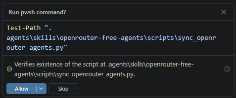
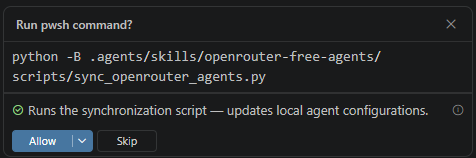
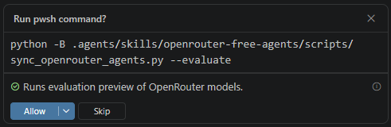
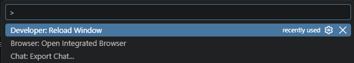
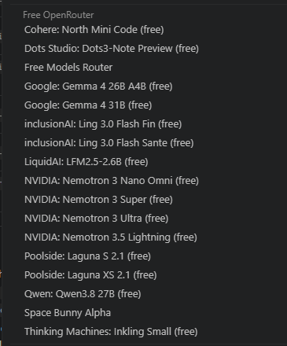

# OpenRouter Free Agents Skill
Updated September 26, 2026.

This GitHub Copilot skill manages free OpenRouter coding models in VS Code Copilot Chat. The skill scans and synchronizes available free OpenRouter models and populates the model selector with a curated list of currently free models for quick access in VS Code Copilot Chat under **Other Models → Free OpenRouter**. The skill updates the custom provider, pins active free models, unpins expired models, and removes legacy generated agent files to keep the agents menu clean.


The OpenRouter Free Agents Skill optionally evalautes the models for health and coding capability, providing a summarized chat report and offers a durable Markdown report for future reference.

## Install

For GitHub Copilot, choose either installation method.

### Clone with Git

```powershell
git clone https://github.com/MindsEyeProducts/OpenRouter-Free-Agents-SKILL.git "$HOME/.copilot/skills/openrouter-free-agents"
```

### Download ZIP

1. [Download the latest ZIP](https://github.com/MindsEyeProducts/OpenRouter-Free-Agents-SKILL/archive/refs/heads/main.zip), or select **Code → Download ZIP** on GitHub.
2. Extract the ZIP and rename the extracted `OpenRouter-Free-Agents-SKILL-main` folder to `openrouter-free-agents`.
3. Move that folder into `%USERPROFILE%\.copilot\skills\` on Windows, creating the `skills` directory if needed.

The resulting file path should be `%USERPROFILE%\.copilot\skills\openrouter-free-agents\SKILL.md`, with `scripts` and `references` alongside it.

## Run

### 1. Run the skill in Copilot Chat

Open your project in VS Code, open Copilot Chat, and enter:

```text
/openrouter-free-agents
```

This synchronizes the free model list and offers an optional coding capability and health evaluation afterward.

To request synchronization, evaluation, and a saved report together, you can also say:

> Sync the free OpenRouter models, evaluate their coding capabilities and health, and save the Markdown report in this project.

Or use the combined command:

```text
/openrouter-free-agents --eval-md
```

With the combined command, evaluation and saving are already requested, so the agent skips the later Y/N questions.

### 2. Review and allow the script

Review each proposed command before selecting **Allow**. In the captured walkthrough, the agent first requested permission to check the script path:



It then requested permission to run the synchronization script:



These screenshots and the example results below were captured on **September 26, 2026**. The number of approval prompts depends on your VS Code settings and how the skill is invoked. Model availability, counts, and health values will change between runs.

### 3. Review the synchronization results

The agent reports the configured models, newly pinned and retained models, models that were unpinned, and any legacy agent files removed. It also lists the active free models and their tool support and context sizes.

<details>
<summary>Example synchronization summary and active model list — September 26, 2026</summary>

#### Free OpenRouter Models Sync Summary
The synchronization script has queried OpenRouter and updated VS Code:

- **Configured Models**: 21 active free models configured under the **Other Models -> Free OpenRouter** group in `chatLanguageModels.json`.
- **Model Selector Pinning (`state.vscdb`)**:
    - **Newly Pinned**: 18 free models
    - **Retained**: 3 existing free models
    - **Unpinned / Cleaned**: 4 models (no longer free or expired)
    - **Total Pinned Models**: 24
- **Custom Agents Status**: Clean. Custom Agents are not populated in GitHub Copilot **Set Agents**, and no legacy `.agent.md` files were found.

##### Active Free Models

| Model ID                                             | Tools |  Context  | Name                                       |
| :--------------------------------------------------- | :---: | :-------: | :----------------------------------------- |
| `cohere/north-mini-code:free`                        |  Yes  |  256,000  | Cohere: North Mini Code (free)             |
| `dots-studio/dots-3-note-preview:free`               |  Yes  |  512,000  | Dots Studio: Dots3-Note Preview (free)     |
| `openrouter/free`                                    |  Yes  |  200,000  | Free Models Router                         |
| `google/gemma-4-26b-a4b-it:free`                     |  Yes  |  262,144  | Google: Gemma 4 26B A4B (free)             |
| `google/gemma-4-31b-it:free`                         |  Yes  |  262,144  | Google: Gemma 4 31B (free)                 |
| `inclusionai/ling-3.0-flash-fin:free`                |  Yes  |  262,144  | inclusionAI: Ling 3.0 Flash Fin (free)     |
| `inclusionai/ling-3.0-flash-sante:free`              |  Yes  |  262,144  | inclusionAI: Ling 3.0 Flash Sante (free)   |
| `liquid/lfm-2.5-2.6b:free`                           |  Yes  |  65,536   | LiquidAI: LFM2.5-2.6B (free)               |
| `nvidia/nemotron-3-nano-omni-30b-a3b-reasoning:free` |  Yes  |  256,000  | NVIDIA: Nemotron 3 Nano Omni (free)        |
| `nvidia/nemotron-3-super-120b-a12b:free`             |  Yes  |  262,144  | NVIDIA: Nemotron 3 Super (free)            |
| `nvidia/nemotron-3-ultra-550b-a55b:free`             |  Yes  | 1,000,000 | NVIDIA: Nemotron 3 Ultra (free)            |
| `nvidia/nemotron-3.5-lightning:free`                 |  Yes  | 1,000,000 | NVIDIA: Nemotron 3.5 Lightning (free)      |
| `poolside/laguna-s-2.1:free`                         |  Yes  |  262,144  | Poolside: Laguna S 2.1 (free)              |
| `poolside/laguna-xs-2.1:free`                        |  Yes  |  262,144  | Poolside: Laguna XS 2.1 (free)             |
| `qwen/qwen3.8-27b:free`                              |  Yes  |  262,144  | Qwen: Qwen3.8 27B (free)                   |
| `stealth/space-bunny-alpha`                          |  Yes  | 1,000,000 | Space Bunny Alpha                          |
| `thinkingmachines/inkling:free`                      |  Yes  | 1,048,576 | Thinking Machines: Inkling (free)          |
| `thinkingmachines/inkling-small:free`                |  Yes  | 1,048,576 | Thinking Machines: Inkling Small (free)    |
| `google/lyria-3-clip-preview`                        |  No   | 1,048,576 | Google: Lyria 3 Clip Preview               |
| `google/lyria-3-pro-preview`                         |  No   | 1,048,576 | Google: Lyria 3 Pro Preview                |
| `nvidia/nemotron-3.5-content-safety:free`            |  No   |  128,000  | NVIDIA: Nemotron 3.5 Content Safety (free) |

</details>

### 4. Optionally evaluate coding capability and health

After a bare `/openrouter-free-agents` invocation, the agent asks:

> Would you like a coding capability and health evaluation of these free models? (Y/N)

Type **Y** to view the evaluation, or **N** to finish without it. The evaluation combines live OpenRouter health data with maintained coding tiers and model notes.

If prompted, review the evaluation command and press **Allow**:



The agent presents model tiers, technical specifications, suggested use cases, and a health table. The following is the example evaluation from the How To walkthrough.

<details>
<summary>Example coding capability and health evaluation — September 26, 2026</summary>

#### OpenRouter Free Models: Coding Capability & Health Evaluation
**Generated**: September 26, 2026  
**Scope**: Models in VS Code Copilot Chat (`Other Models -> Free OpenRouter`)  
**Total Evaluated Models**: 21

---

##### 1. Overview & Evaluation Criteria

This document provides a technical evaluation of the active free models available on OpenRouter, assessed for real-world software engineering, code generation, refactoring, agentic tool use (reading/editing files, executing commands, running tests), and **real-time operational health**.

###### Evaluation Dimensions

- **Coding Benchmarks & Training**: Dedicated code fine-tuning vs. general-purpose instruct.
- **Operational Health**: Real-time provider availability, 5m and 24h uptime %, and response latency.
- **Tool Calling (`tools`)**: Critical for GitHub Copilot Chat tool use (search, read, edit, terminal execution).
- **Reasoning Architecture**: MoE parameter efficiency, dedicated reasoning tokens, chain-of-thought support.
- **Context Window**: Ability to ingest entire multi-file codebases, logs, and documentation.
- **Latency & Throughput**: Suitability for fast iterative programming vs. deep architectural design.

---

##### 2. Tier Summary & Technical Specifications

> **Health Legend**: 🟢 Healthy / High Availability (≥95% uptime)  |  🟡 Degraded / Reduced Availability (<95% uptime)  |  🔴 Offline / Outage

|Tier|Model|Health|Context|Params (Active / Total)|Tools|Reasoning|Best Use Case|
|:--|:--|:-:|:--|:--|:-:|:-:|:--|
|**S**|**Cohere: North Mini Code (free)**|🟢|256K|3B / 30B (MoE)|Yes|Yes|**Code Generation**: Cohere’s dedicated agentic coding model; high syntactic precision.|
|**S**|**Poolside: Laguna S 2.1 (free)**|🟢|262K|8B / 118B (MoE)|Yes|Yes|**Primary Coding Agent**: 70.2% on Terminal-Bench 2.1; terminal & refactoring workflows.|
|**S**|**Thinking Machines: Inkling (free)**|🟢|1.05M|41B / 975B (MoE)|Yes|Configurable|**Frontier Reasoning**: Massive 1M context, system design, and complex algorithmic debugging.|
|**A**|**Google: Gemma 4 31B (free)**|🟢|262K|30.7B (Dense)|Yes|Yes|**General Engineering**: Dense parameter quality; consistent across Python, TS/JS, Rust, C++.|
|**A**|**NVIDIA: Nemotron 3 Ultra (free)**|🟢|1.00M|55B / 550B (Hybrid MoE)|Yes|Configurable|**Large-Scale Architecture**: Hybrid Transformer-Mamba; multi-file codebase reasoning.|
|**A**|**Poolside: Laguna XS 2.1 (free)**|🟢|262K|3B / 33B (MoE)|Yes|Yes|**Low-Latency Coding**: Fast, interactive inline editing and terminal commands.|
|**B**|Dots Studio: Dots3-Note Preview (free)|🟢|512K|16B / 280B (MoE)|Yes|Yes|**Architecture Notes & Specs**: Technical design documents, API specs, and schemas.|
|**B**|Google: Gemma 4 26B A4B (free)|🟢|262K|3.8B / 25.2B (MoE)|Yes|Yes|**Fast Assistant**: Lightweight MoE delivering near-31B quality at higher token throughput.|
|**B**|NVIDIA: Nemotron 3 Super (free)|🟢|262K|12B / 120B (Hybrid MoE)|Yes|Configurable|**Backend & Scripting**: Hybrid Mamba architecture for structured outputs.|
|**B**|Qwen: Qwen3.8 27B (free)|🟢|262K|N/A|Yes|Yes|Qwen3.8 27B is an open-weight dense vision-language model from Qwen. It is suite|
|**B**|Space Bunny Alpha|🟢|1.00M|N/A|Yes|Yes|Space Bunny Alpha is an anonymous large model with blazing-fast inference, stron|
|**B**|Thinking Machines: Inkling Small (free)|🟢|1.05M|12B / 276B (MoE)|Yes|Configurable|**Fast Code Review**: High context window for repository audits and PR reviews.|
|**C**|Free Models Router|🟢|200K|Dynamic Router|Yes|Yes|**Fallback**: Automatically balances across available free endpoints when rate-limited.|
|**C**|NVIDIA: Nemotron 3 Nano Omni (free)|🟡|256K|3B / 30B (MoE)|Yes|Yes|**Visual UI Inspection**: Multimodal input (inspecting mockups, UI bugs, diagrams).|
|**C**|NVIDIA: Nemotron 3.5 Lightning (free)|🟡|1.00M|3B / 30B (MoE)|Yes|Yes|**High-Throughput Utility**: Lint fixes, boilerplate expansion, and quick file parsing.|
|**N/A**|Google: Lyria 3 Clip Preview|🟢|1.05M|Audio/Music Model|No|No|_Audio synthesis_: Music generation API preview models.|
|**N/A**|Google: Lyria 3 Pro Preview|🟢|1.05M|Audio/Music Model|No|No|_Audio synthesis_: Music generation API preview models.|
|**N/A**|inclusionAI: Ling 3.0 Flash Fin (free)|🟢|262K|5.1B / 124B (MoE)|Yes|Yes|_Domain specific_: Tuned for financial data/models rather than general programming.|
|**N/A**|inclusionAI: Ling 3.0 Flash Sante (free)|🟢|262K|5.1B / 124B (MoE)|Yes|Yes|_Domain specific_: Tuned for healthcare/medical terminology.|
|**N/A**|LiquidAI: LFM2.5-2.6B (free)|🟢|65K|2.6B|Yes|Yes|_Not recommended_: Provider explicitly advises against agentic coding.|
|**N/A**|NVIDIA: Nemotron 3.5 Content Safety (free)|🟢|128K|4B|No|No|_Guardrail only_: Safety and moderation filter.|

---

##### 3. Recommended Models by Use Case

###### 1. Daily Coding, Bug Fixing & Refactoring

- **Primary Pick**: `poolside/laguna-s-2.1:free` (**Poolside: Laguna S 2.1**)
    - Built specifically for coding agents, diff generation, and terminal tool calls.
    - Strong benchmark results on Terminal-Bench 2.1 (70.2%).
- **Secondary Pick**: `cohere/north-mini-code:free` (**Cohere: North Mini Code**)
    - Cohere’s specialized agentic coding model with strict syntactic precision and clean documentation generation.

###### 2. Complex Architecture, System Design & Large Repositories

- **Primary Pick**: `thinkingmachines/inkling:free` (**Thinking Machines: Inkling**)
    - 41B active parameters / 975B total with a 1,048,576-token context window.
    - Excels at tracing complicated bugs across large workspaces and designing modular architectures.
- **Alternative**: `nvidia/nemotron-3-ultra-550b-a55b:free` (**NVIDIA: Nemotron 3 Ultra**)
    - 55B active parameters; hybrid Transformer-Mamba architecture capable of high-throughput reasoning.

###### 3. Fast Interactive Iteration (Low Latency)

- **Primary Pick**: `poolside/laguna-xs-2.1:free` (**Poolside: Laguna XS 2.1**)
    - Activates only 3B parameters per token for near-instant responses on unit test generation and single-function refactoring.
- **Alternative**: `google/gemma-4-26b-a4b-it:free` (**Google: Gemma 4 26B A4B**)
    - 3.8B active parameters; balanced speed and reasoning for quick shell scripts and boilerplate.

###### 4. Multimodal UI & Visual Design Work

- **Primary Pick**: `google/gemma-4-31b-it:free` (**Google: Gemma 4 31B**) or `minimax/minimax-m3:free` (**MiniMax M3**)
    - Native image understanding enables inspecting screenshots, wireframes, and design specs to produce matching front-end code (HTML/Tailwind, React, Vue, Flutter).

---

##### 4. How to Select Models in VS Code Copilot Chat

1. Open **GitHub Copilot Chat** in VS Code (`Ctrl+Alt+I` or click the Chat icon in the Activity Bar).
2. Click the **Model Selector** dropdown at the bottom of the chat panel.
3. Select your model under **Other Models -> Free OpenRouter** (or under **Pinned Models**).
4. Recommended starting model: **Poolside: Laguna S 2.1 (free)** or **Cohere: North Mini Code (free)**.

---

##### 5. Real-Time Model Health & Operational Status

Telemetry pulled directly from OpenRouter endpoint monitoring:

|Model|Upstream Provider|Status|5m Uptime|24h Uptime|Latency (TTFT)|30m Demand|
|:--|:--|:-:|:-:|:-:|:-:|:-:|
|**Cohere: North Mini Code (free)**|Cohere|🟢 **Online**|97.6%|97.84%|Fast|Dynamic|
|**Poolside: Laguna S 2.1 (free)**|Poolside|🟢 **Online**|99.8%|99.88%|Fast|Dynamic|
|**Thinking Machines: Inkling (free)**|Thinking Machines|🟢 **Online**|99.8%|99.49%|Fast|Dynamic|
|**Google: Gemma 4 31B (free)**|Google AI Studio|🟢 **Online**|100.0%|99.59%|Fast|Dynamic|
|**NVIDIA: Nemotron 3 Ultra (free)**|Nvidia|🟢 **Online**|99.0%|98.40%|Fast|Dynamic|
|**Poolside: Laguna XS 2.1 (free)**|Poolside|🟢 **Online**|99.7%|99.75%|Fast|Dynamic|
|**Dots Studio: Dots3-Note Preview (free)**|AtlasCloud|🟢 **Online**|99.8%|99.91%|Fast|Dynamic|
|**Google: Gemma 4 26B A4B (free)**|Google AI Studio|🟢 **Online**|100.0%|99.69%|Fast|Dynamic|
|**NVIDIA: Nemotron 3 Super (free)**|Nvidia|🟢 **Online**|98.6%|95.86%|Fast|Dynamic|
|**Qwen: Qwen3.8 27B (free)**|ModelRun|🟢 **Online**|100.0%|97.63%|Fast|Dynamic|
|**Space Bunny Alpha**|Stealth|🟢 **Online**|100.0%|99.91%|Fast|Dynamic|
|**Thinking Machines: Inkling Small (free)**|Thinking Machines|🟢 **Online**|100.0%|99.96%|Fast|Dynamic|
|**Free Models Router**|OpenRouter Gateway|🟢 **Online**|100%|100%|Dynamic|High|
|**NVIDIA: Nemotron 3 Nano Omni (free)**|Nvidia|🟡 Degraded (-5)|76.1%|80.81%|Fast|Dynamic|
|**NVIDIA: Nemotron 3.5 Lightning (free)**|Nvidia|🟡 Degraded (-2)|90.6%|87.10%|Fast|Dynamic|
|**Google: Lyria 3 Clip Preview**|Google AI Studio|🟢 **Online**|100%|100.00%|Fast|Dynamic|
|**Google: Lyria 3 Pro Preview**|Google AI Studio|🟢 **Online**|100%|99.94%|Fast|Dynamic|
|**inclusionAI: Ling 3.0 Flash Fin (free)**|Novita|🟢 **Online**|100.0%|99.99%|Fast|Dynamic|
|**inclusionAI: Ling 3.0 Flash Sante (free)**|Novita|🟢 **Online**|100.0%|100.00%|Fast|Dynamic|
|**LiquidAI: LFM2.5-2.6B (free)**|Liquid|🟢 **Online**|100.0%|99.39%|Fast|Dynamic|
|**NVIDIA: Nemotron 3.5 Content Safety (free)**|Nvidia|🟢 **Online**|99.1%|97.34%|Fast|Dynamic|

---

</details>

### 5. Save the evaluation

After showing an optional evaluation, the agent asks:

> Would you like to save this evaluation as `OpenRouter_Free_Models_Coding_Capability.md` in the current workspace? (Y/N)

Type **Y** to save a permanent Markdown copy in your project's root directory, or **N** to keep only the chat preview. The agent saves the displayed evaluation without fetching health or synchronizing again.

When you use `--eval-md` upfront, the report is saved as part of the combined run. The agent confirms the location and summarizes the saved evaluation.

<details>
<summary>Example summary of the saved evaluation — September 26, 2026</summary>

- **Tier S Models**: `cohere/north-mini-code:free`, `poolside/laguna-s-2.1:free`, and `thinkingmachines/inkling:free` (all 🟢 Online).
- **Tier A Models**: `google/gemma-4-31b-it:free`, `nvidia/nemotron-3-ultra-550b-a55b:free`, and `poolside/laguna-xs-2.1:free` (all 🟢 Online).
- **Operational Health**: Detailed 5-minute and 24-hour uptime metrics, response latency tiers, and upstream provider status for all 21 active free models.

</details>

See [OpenRouter_Free_Models_Coding_Capability.md](./OpenRouter_Free_Models_Coding_Capability.md) for an example saved report.

### 6. Reload VS Code and select a model

After synchronization and any chosen evaluation or save steps finish, press `Ctrl+Shift+P` (or `F1`) and run **Developer: Reload Window**:



Then open the model selector at the bottom of Copilot Chat and choose a model under **Other Models → Free OpenRouter**:



**If you find this skill useful, consider [buying me a ☕](https://buymeacoffee.com/mindseyeproducts).**

### Other workflows

| What you want | Enter in Copilot Chat |
| --- | --- |
| Sync models and save the evaluation | `/openrouter-free-agents --eval-md` |
| Sync only models with tool support and save the evaluation | `/openrouter-free-agents --tools-only --eval-md` |
| Preview the evaluation without modifying VS Code or saving a report | `/openrouter-free-agents --evaluate` |
| List currently free models without changes | `/openrouter-free-agents --list` |
| Preview synchronization changes without applying them | `/openrouter-free-agents --dry-run` |
| Sync only, without evaluation | `/openrouter-free-agents sync only; no evaluation` |

The staged workflow can require separate approvals for synchronization, evaluation, and saving. Use `--eval-md` upfront to complete synchronization and report generation in one script invocation.

### Direct terminal alternative

With the personal Copilot skill installed, run this from your project directory:

```powershell
python -B "$HOME/.copilot/skills/openrouter-free-agents/scripts/sync_openrouter_agents.py" --eval-md
```

If running from another directory, add `--workspace-dir "C:\path\to\your\project"`. An optional filename can follow `--eval-md`; for example, `--eval-md "free-model-report.md"` saves that filename in the selected project.

`--eval-md` performs synchronization as well as report generation. `--evaluate` previews the report without modifying VS Code or saving a file. `--no-db-sync` skips only database updates; provider configuration and legacy file cleanup still run.

## Prerequisites

Before installing and running this skill, make sure you have:

- **VS Code with Copilot Chat available.** Use a desktop installation with support for agent skills, terminal commands, and custom model providers. The setup instructions in this README use Windows and PowerShell.
- **Python 3 available in your terminal.** Confirm that `python --version` reports a Python 3 installation. The bundled script uses the Python standard library; no additional Python packages are required.
- **An OpenRouter account and API key configured in VS Code.** Create a key in your [OpenRouter account settings](https://openrouter.ai/settings/keys), then add OpenRouter through **Chat: Manage Language Models**. Follow the [OpenRouter setup guide for Copilot](https://openrouter.ai/works-with-openrouter/github-copilot).
- **Internet access to OpenRouter.** The skill retrieves the model catalog and health data from `https://openrouter.ai/api/v1`.
- **A local project folder open in VS Code.** Run the skill from that project so any requested Markdown report is saved in the intended location. The synchronization script also needs permission to update your VS Code user configuration and model pinning data.

### Configure OpenRouter before the first sync

Open the Command Palette with `Ctrl+Shift+P`, run **Chat: Manage Language Models**, and add the OpenRouter provider with your API key. Confirm that an OpenRouter model is available in the model selector before running this skill. See [VS Code's model configuration documentation](https://code.visualstudio.com/docs/agent-customization/language-models).

The current script expects an existing `chatLanguageModels.json` configuration and reuses a configured provider's API-key reference. It does not create your OpenRouter account or register a new API key. On Windows, it looks for the standard VS Code user configuration under `%APPDATA%\Code\User\`.

### Optional: Git

Install Git if you plan to use the **Clone with Git** installation method. The **Download ZIP** 

## Contents

- [SKILL.md](./SKILL.md) — agent instructions and supported workflows
- [README.md](./README.md) — installation and usage walkthrough with screenshots, example results, and commands
- [scripts/sync_openrouter_agents.py](./scripts/sync_openrouter_agents.py) — model synchronization, evaluation preview, and Markdown report generation
- [assets/run/](./assets/run/) — screenshots used in the usage walkthrough
- [references/openrouter-api.md](./references/openrouter-api.md) — OpenRouter API notes
- [references/agent-pinning.md](./references/agent-pinning.md) — VS Code provider and model pinning details
- [OpenRouter_Free_Models_Coding_Capability.md](./OpenRouter_Free_Models_Coding_Capability.md) — generated coding capability and health report
- [tests/test_sync_workflows.py](./tests/test_sync_workflows.py) — checks for synchronization, preview, reporting, and dry-run behavior

## Support

If you find this skill useful, consider [buying me a ☕](https://buymeacoffee.com/mindseyeproducts).

## License

MIT
